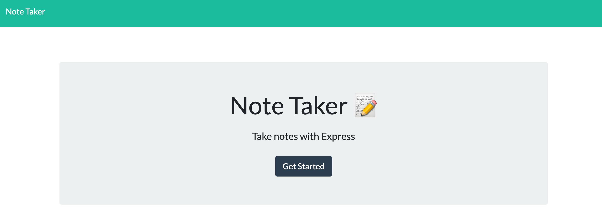
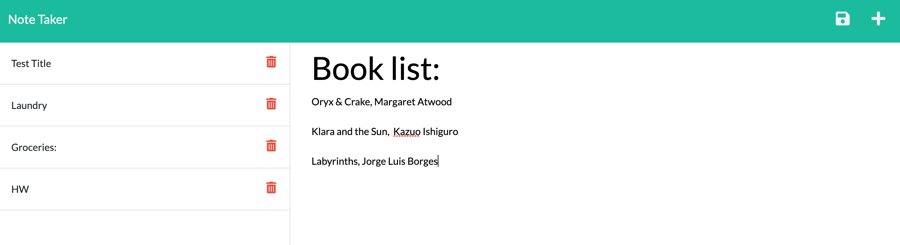

# note-taker

## Description
Store all your notes quickly and easily with this simple note taking app. This app was my first time working with express.js  on the backend. I hope you like it!

## Table of Contents (Optional)

- [Installation](#installation)
- [Usage](#usage)
- [Credits](#credits)
- [License](#license)

## Installation

N/A

## Usage

To use the note taker yourself, visit it [here](https://murmuring-sands-54732.herokuapp.com/)!

## Credits
N/A

## License
This work is covered by a MIT license, for more information read about the license [here](https://choosealicense.com/licenses/mit/).

## How to Contribute
If you have any suggestions or questions about the project, I'd love to hear from you! 

Please reach out to me here on Github, at ChelsRunnn.